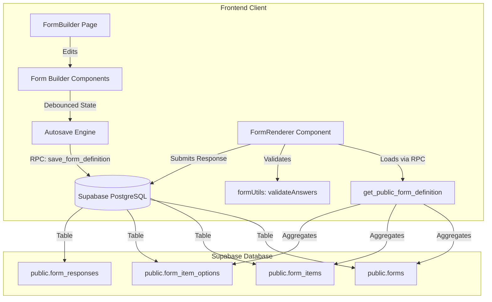
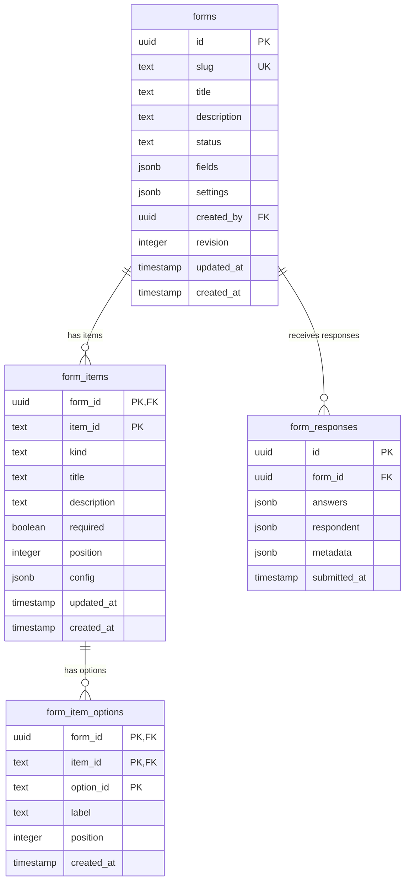
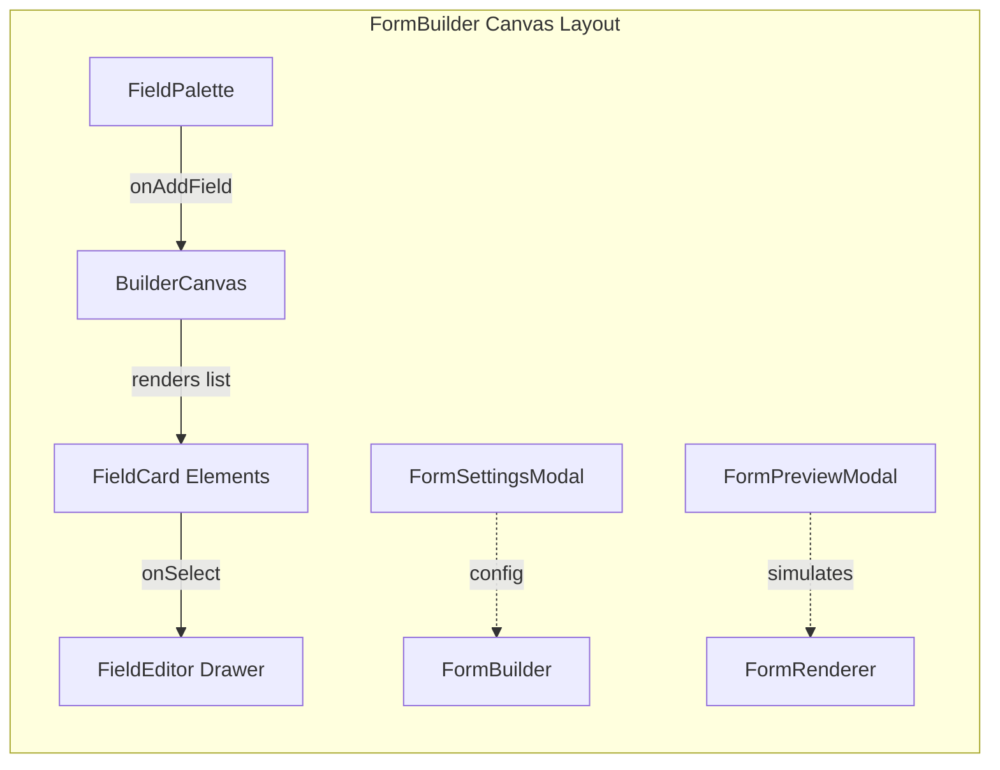
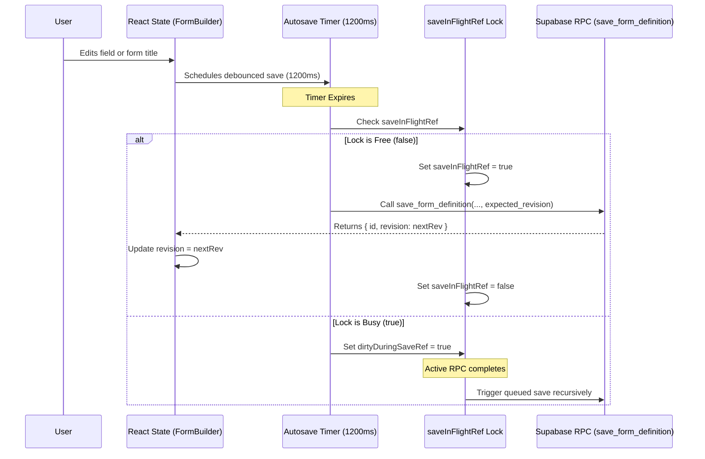

# Architecture Specification: Dynamic Form Engine Subsystem

## 1. Subsystem Overview

The dynamic form engine in the Init-Website application provides a normalized, schema-driven framework for creating, editing, rendering, and submitting custom forms. The subsystem is engineered around a clean separation of concerns across database storage, administrative builder tools, and public rendering interfaces.



### Core Design Principles

- **Relational Normalization**: Form structure is decomposed into relational tables (`forms`, `form_items`, `form_item_options`) rather than unindexed, monolithic JSON blobs. This enables index-backed constraints, efficient subqueries, and clean data integrity.
- **Optimistic Concurrency Control**: Form updates rely on revision numbers (`revision`) to prevent stale admin sessions from overwriting concurrent modifications.
- **Atomic Operations via Stored Procedures**: Multi-table updates (deleting legacy fields/options and re-inserting updated structures) are executed inside atomic PL/pgSQL database functions.
- **Non-Blocking Autosave Engine**: The form editor maintains live state, executing background RPC saves with concurrency locking (`saveInFlightRef`), edit queuing (`dirtyDuringSaveRef`), and request timeouts (`AbortController`).
- **Accessible Custom Form Components**: Form rendering replaces default browser controls with styled Obsidian-themed interactive components while enforcing client-side validation and automatic scroll-to-error navigation.

---

## 2. Database Entities & Schema

The dynamic form subsystem is built on four core tables in the `public` schema.



### 2.1. Table: `public.forms`

Acts as the root container for a form definition.

| Column | Type | Constraints | Description |
| :--- | :--- | :--- | :--- |
| `id` | `uuid` | `PRIMARY KEY`, Default `gen_random_uuid()` | Unique identifier for the form. |
| `slug` | `text` | `NOT NULL`, `UNIQUE` | Unique URL-friendly slug used for public routes. |
| `title` | `text` | `NOT NULL` | Display title of the form. |
| `description` | `text` | Optional | Detailed summary or header text for respondents. |
| `status` | `text` | Default `'draft'`, Check (`'draft'`, `'published'`, `'closed'`) | Publication lifecycle state. |
| `fields` | `jsonb` | Default `'[]'::jsonb`, `NOT NULL` | Legacy field storage (cleared to `[]` after normalization). |
| `settings` | `jsonb` | Default `'{}'::jsonb`, `NOT NULL` | Global configuration options (auth requirements, schedule, limits). |
| `created_by` | `uuid` | Foreign Key -> `public.users(id)` ON DELETE SET NULL | Profile ID of the creator. |
| `revision` | `integer` | Default `1`, `NOT NULL` | Monotonically increasing revision counter for optimistic lock check. |
| `created_at` | `timestamptz` | Default `now()` | Timestamp when record was created. |
| `updated_at` | `timestamptz` | Default `now()` | Timestamp when record was last updated. |

### 2.2. Table: `public.form_items`

Stores discrete input questions or section dividers belonging to a form.

| Column | Type | Constraints | Description |
| :--- | :--- | :--- | :--- |
| `form_id` | `uuid` | Foreign Key -> `public.forms(id)` ON DELETE CASCADE | Parent form identifier. |
| `item_id` | `text` | `NOT NULL` | Unique item identifier within the form scope. |
| `kind` | `text` | `NOT NULL`, Check (`'text'`, `'email'`, `'number'`, `'textarea'`, `'select'`, `'radio'`, `'multiselect'`, `'checkbox'`, `'date'`, `'rating'`, `'section'`) | Input control type or section header. |
| `title` | `text` | `NOT NULL` | Label or prompt displayed for the field. |
| `description` | `text` | Optional | Help text or guidance hint displayed beneath label. |
| `required` | `boolean` | Default `false`, `NOT NULL` | Mandatory completion flag. |
| `position` | `integer` | `NOT NULL`, Check (`position >= 0`) | Display sequence index within canvas. |
| `config` | `jsonb` | Default `'{}'::jsonb`, `NOT NULL` | Structured metadata (`placeholder`, `scale`, `validation`). |
| `created_at` | `timestamptz` | Default `now()` | Creation timestamp. |
| `updated_at` | `timestamptz` | Default `now()` | Last modification timestamp. |

**Primary Key & Indexes**:
- Primary Key: `(form_id, item_id)`
- Unique Index: `idx_form_items_form_position ON (form_id, position)`
- Index: `idx_form_items_form_kind ON (form_id, kind)`

### 2.3. Table: `public.form_item_options`

Normalizes choice items for selectable fields (`select`, `radio`, `multiselect`).

| Column | Type | Constraints | Description |
| :--- | :--- | :--- | :--- |
| `form_id` | `uuid` | `NOT NULL` | Parent form identifier. |
| `item_id` | `text` | `NOT NULL` | Associated item identifier. |
| `option_id` | `text` | `NOT NULL` | Unique option choice identifier within item scope. |
| `label` | `text` | `NOT NULL` | User-visible text choice. |
| `position` | `integer` | `NOT NULL`, Check (`position >= 0`) | Display sequence index. |
| `created_at` | `timestamptz` | Default `now()` | Creation timestamp. |

**Primary Key & Constraints**:
- Primary Key: `(form_id, item_id, option_id)`
- Foreign Key: `(form_id, item_id) REFERENCES public.form_items(form_id, item_id) ON DELETE CASCADE`
- Unique Index: `idx_form_item_options_item_position ON (form_id, item_id, position)`

### 2.4. Table: `public.form_responses`

Stores submitted responses from respondents.

| Column | Type | Constraints | Description |
| :--- | :--- | :--- | :--- |
| `id` | `uuid` | `PRIMARY KEY`, Default `gen_random_uuid()` | Response submission unique ID. |
| `form_id` | `uuid` | Foreign Key -> `public.forms(id)` ON DELETE CASCADE | Associated form ID. |
| `answers` | `jsonb` | Default `'{}'::jsonb`, `NOT NULL` | Key-value map (`item_id` -> submitted answer value). |
| `respondent` | `jsonb` | Default `'{}'::jsonb` | User identity details (user ID, email if authenticated). |
| `metadata` | `jsonb` | Default `'{}'::jsonb` | System submission metadata (IP, user agent, session duration). |
| `submitted_at` | `timestamptz` | Default `now()` | Submission timestamp. |

---

## 3. Database Stored Procedures (PL/pgSQL RPCs)

All read and write operations against form definitions are executed through security definer PL/pgSQL routines.

### 3.1. RPC: `save_form_definition`

Handles atomic creation or update of forms, enforcing optimistic revision locking and replacing child items and options.

```sql
CREATE OR REPLACE FUNCTION "public"."save_form_definition"(
  "p_form_id" uuid DEFAULT NULL,
  "p_title" text DEFAULT NULL,
  "p_description" text DEFAULT NULL,
  "p_slug" text DEFAULT NULL,
  "p_status" text DEFAULT 'draft',
  "p_settings" jsonb DEFAULT '{}'::jsonb,
  "p_created_by" uuid DEFAULT NULL,
  "p_items" jsonb DEFAULT '[]'::jsonb,
  "p_expected_revision" integer DEFAULT NULL
)
RETURNS TABLE (
  "id" uuid,
  "revision" integer
)
```

#### Execution Logic Workflow

1. **Authorization Verification**: Evaluates `public.is_admin()`. Raises error `42501` if user lacks admin credentials.
2. **Validation**: Enforces non-empty strings for `p_title` and `p_slug`.
3. **Creation Path (`p_form_id IS NULL`)**:
   - Inserts record into `public.forms` with `revision = 1`.
   - Returns generated `v_form_id` and initial revision `1`.
4. **Update Path (`p_form_id IS NOT NULL`)**:
   - Executes `UPDATE public.forms` setting title, slug, description, status, settings, updating `updated_at = now()`, and incrementing `revision = forms.revision + 1`.
   - Enforces optimistic lock: `WHERE forms.id = p_form_id AND (p_expected_revision IS NULL OR forms.revision = p_expected_revision)`.
   - If no row is modified (due to revision mismatch), raises error `40001` (`Form revision conflict`).
   - Clears existing child items: `DELETE FROM public.form_items WHERE form_id = v_form_id` (cascades to options).
5. **Item & Option Reconstruction**:
   - Unpacks `p_items` JSONB array using `jsonb_array_elements(...) WITH ORDINALITY`.
   - Inserts rows into `public.form_items`.
   - Unpacks options for each item using `CROSS JOIN LATERAL jsonb_array_elements_text(...) WITH ORDINALITY`.
   - Inserts rows into `public.form_item_options`.
6. **Return Output**: Returns table containing `id` and incremented `revision`.

### 3.2. RPC: `get_form_definition`

Constructs full form definition payload for administrative editing.

```sql
CREATE OR REPLACE FUNCTION "public"."get_form_definition"("p_form_id" uuid)
RETURNS jsonb
```

#### Execution Logic Workflow

1. Verifies `public.is_admin()`. Raises `42501` if non-admin.
2. Selects form record from `public.forms`.
3. Executes subquery against `public.form_items` ordered by `position`.
4. For each item, executes nested subquery against `public.form_item_options` ordered by `position` if `kind` is choice-based (`select`, `radio`, `multiselect`).
5. Uses `jsonb_build_object` and `jsonb_strip_nulls` to shape data matching frontend `Form` TypeScript interfaces.
6. Returns aggregated JSONB payload.

### 3.3. RPC: `get_public_form_definition`

Retrieves published form structures for public respondents based on slug.

```sql
CREATE OR REPLACE FUNCTION "public"."get_public_form_definition"("p_slug" text)
RETURNS jsonb
```

#### Execution Logic Workflow

1. Accessible to both `anon` and `authenticated` roles.
2. Performs lookup matching `lower(trim(p_slug))` and filtering by `status = 'published'`.
3. Aggregates items and options into identical JSON schema as `get_form_definition`.
4. Returns NULL if form does not exist or is in `draft`/`closed` state.

### 3.4. RPC: `list_forms_overview`

Provides overview listing of all forms along with live response and item counts.

```sql
CREATE OR REPLACE FUNCTION "public"."list_forms_overview"()
RETURNS TABLE (
  "id" uuid,
  "slug" text,
  "title" text,
  "description" text,
  "status" text,
  "updated_at" timestamp with time zone,
  "response_count" bigint,
  "field_count" bigint,
  "revision" integer
)
```

#### Execution Logic Workflow

1. Verifies `public.is_admin()`.
2. Selects fields from `public.forms`.
3. Joins `LEFT JOIN LATERAL` subquery computing `COUNT(*)` from `public.form_responses`.
4. Joins `LEFT JOIN LATERAL` subquery computing `COUNT(*)` from `public.form_items` excluding `kind = 'section'`.
5. Orders results by `updated_at DESC`.

---

## 4. Frontend Form Builder Architecture

Located at `src/components/forms/builder/` and driven by the page orchestrator `src/pages/admin/FormBuilder.tsx`.



### 4.1. Component Breakdown

#### `FieldPalette.tsx`
Sidebar component rendering element buttons for 11 field primitives:
- Short Text (`text`)
- Email (`email`)
- Number (`number`)
- Long Text (`textarea`)
- Dropdown (`select`)
- Radio Choice (`radio`)
- Multi-Select (`multiselect`)
- Checkbox (`checkbox`)
- Date Pick (`date`)
- Star Rating (`rating`)
- Section Divider (`section`)

#### `BuilderCanvas.tsx`
Central workspace displaying ordered form fields.
- Handles element reordering via `moveField(index, direction)`.
- Renders empty state graphics when no fields are present.
- Maps `fields` state to `FieldCard` components.

#### `FieldCard.tsx`
Individual card container for canvas fields.
- Visual icon indicator based on field `kind`.
- Reorder action buttons (`ChevronUp`, `ChevronDown`).
- Displays mandatory badges (`*`), title, and help text hint.
- Hover quick action bar for selection, duplication, and deletion.

#### `FieldEditor.tsx`
Right-hand settings inspector drawer.
- Updates field label, placeholder, and help text.
- Toggles mandatory constraint (`required`).
- Configures star rating scales (5 vs 10 stars).
- Dynamic list manager for choice options (`select`, `radio`, `multiselect`).
- Configures validation rules (`min`, `max`, `minLength`, `maxLength`, regex `pattern`).

#### `FormSettingsModal.tsx`
Modal dialog for configuring global form behavior:
- Multi-submission permission (`allow_multiple_responses`).
- Authentication requirement (`require_auth`).
- Scheduling boundaries (`open_at`, `close_at`).
- Completion message (`success_message`) and redirect target (`redirect_url`).
- Maximum response limits (`max_responses`).
- Completion progress bar visibility (`show_progress_bar`).

#### `FormPreviewModal.tsx`
Full-screen modal offering live preview of form layout, replicating respondent perspective with disabled input fields.

### 4.2. Autosave Engine Mechanics

The form editor uses a debounced autosave architecture in `src/pages/admin/FormBuilder.tsx` to persist updates without manual intervention.



#### Key Technical Guards

1. **Debounce Delay (1200ms)**: React `useEffect` watches dependencies (`[title, description, slug, status, fields, settings]`) and resets `autosaveTimerRef` on changes.
2. **First-Load Protection (`skipNextAutosaveRef`)**: Flag set to `true` during initial RPC fetch or creation transition to prevent firing autosave on unmodified loaded state.
3. **Concurrency Locking (`saveInFlightRef`)**: Boolean ref preventing concurrent overlapping save requests. If an edit occurs while a save is in flight, `dirtyDuringSaveRef.current` is flagged.
4. **Edit Queue (`dirtyDuringSaveRef`)**: When a save completes in `finally`, it checks `dirtyDuringSaveRef`. If `true`, it immediately triggers a follow-up silent save to ensure recent changes are saved.
5. **Timeout Protection (`AbortController` & `SAVE_TIMEOUT_MS`)**: Enforces a 25-second maximum timeout (`SAVE_TIMEOUT_MS = 25000`) via `AbortController`. Cancels hung network requests.
6. **Unmount Cleanup**: `useEffect` cleanup handler clears pending timeouts and aborts active HTTP requests on component unmount.
7. **Revision Synchronization**: Updates local `revision` state upon receiving response from `save_form_definition`, preserving the optimistic locking chain.

---

## 5. Frontend Form Renderer Architecture

Located at `src/components/forms/renderer/` and driven by `FormRenderer.tsx`.

### 5.1. Component Breakdown

#### `FormProgress.tsx`
Calculates and renders completion progress.
- Computes `percentage = Math.round((filled / total) * 100)`.
- Ignores `section` fields in calculation.
- Renders animated gradient bar (`from-cyan-400 to-purple-500`).

#### Custom Obsidian Control Components

- **`CustomFormSelect`**: Replaces browser native select elements with custom dark menu container, click-outside ref listener, active choice checkmarks, and smooth opening animations.
- **Rating Scale Buttons**: Grid of numbered buttons (1 to scale limit) with cyan glow highlights on active state.
- **Radio & Multi-Select Pills**: Custom styled interactive selection pills with customized radio dot and checkbox checkmark icons.
- **Date Inputs**: Custom styled dark calendar input with calendar icon overlay.

### 5.2. Client-Side Validation Engine (`src/utils/formUtils.ts`)

Validation is driven by `validateAnswers(fields, answers)`. Returns a record mapping `fieldId -> error string | null`.

```typescript
export function validateAnswers(
  fields: FormField[],
  answers: Record<string, any>
): Record<string, string | null>
```

#### Validation Rules Evaluated

1. **Required Fields**: Checks if value is `undefined`, `null`, empty string, or empty array.
2. **Email Format**: Evaluates regex `/^[^\s@]+@[^\s@]+\.[^\s@]+$/`.
3. **Numeric Rules**: Validates `isNaN(num)` and enforces `validation.min` and `validation.max`.
4. **Text Rules**: Strips text and enforces `validation.minLength`, `validation.maxLength`, and custom regex `validation.pattern`.
5. **Multi-Select Rules**: Verifies non-empty array selection for required multi-select fields.

### 5.3. Error Boundary Highlights & Navigation

1. **Live Validation Mode**: After an initial submit attempt (`hasTriedSubmit = true`), input value modifications trigger immediate live re-validation.
2. **Error Card Highlights**: Invalid fields render with red tinted borders (`border-red-500/25`), red callout background, and an inline error badge with message.
3. **Global Callout Alert**: A persistent red alert banner appears at the top of the form when submission errors exist.
4. **Scroll-To-Error Behavior**: On failed submission, the renderer locates the first invalid field ID and invokes:

```typescript
document.getElementById(`el-${firstErrorId}`)?.scrollIntoView({
  behavior: 'smooth',
  block: 'center'
});
```

---

## 6. Data Transformations & Serialization

Handled by helper utilities in `src/utils/formDefinition.ts`.

### Serialization (`serializeFormFields`)
Converts in-memory `FormField[]` array into normalized `SerializedFormItemInput[]` structure expected by `save_form_definition` RPC:
- Orders fields by `position`.
- Strips null/empty validation properties using `compactValidation`.
- Formats configuration payload containing `placeholder`, `scale`, and `validation`.
- Converts array of string options into trimmed string arrays.

### Normalization (`normalizeFormRecord`)
Parses database RPC output into frontend React state:
- Sorts `fields` array by `order`.
- Merges raw `settings` object with `defaultSettings` fallbacks.
- Handles revision assignment and null values safely.
